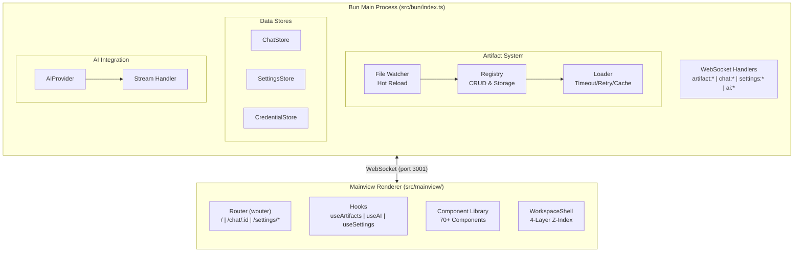
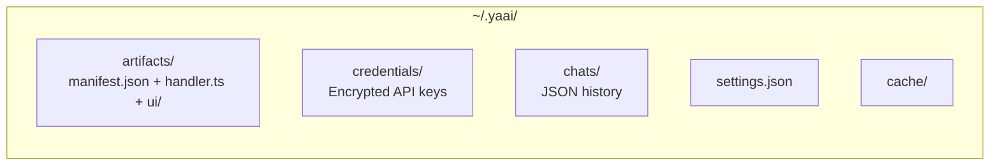
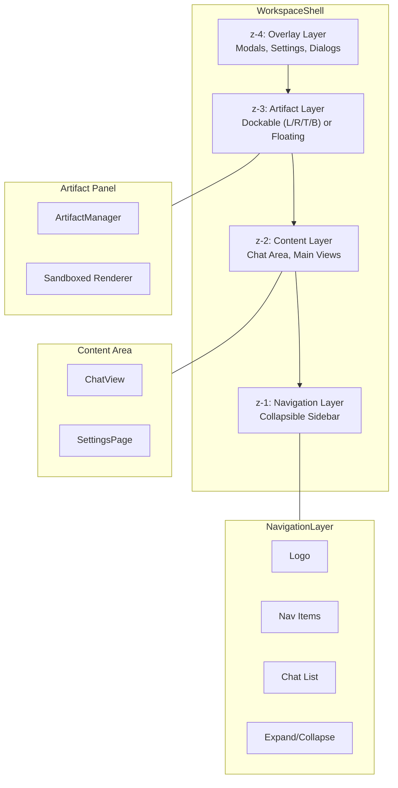
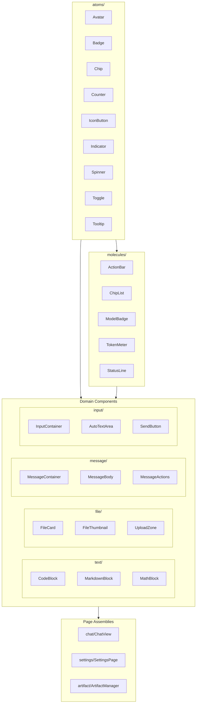
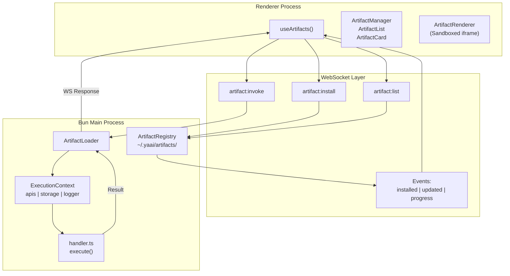
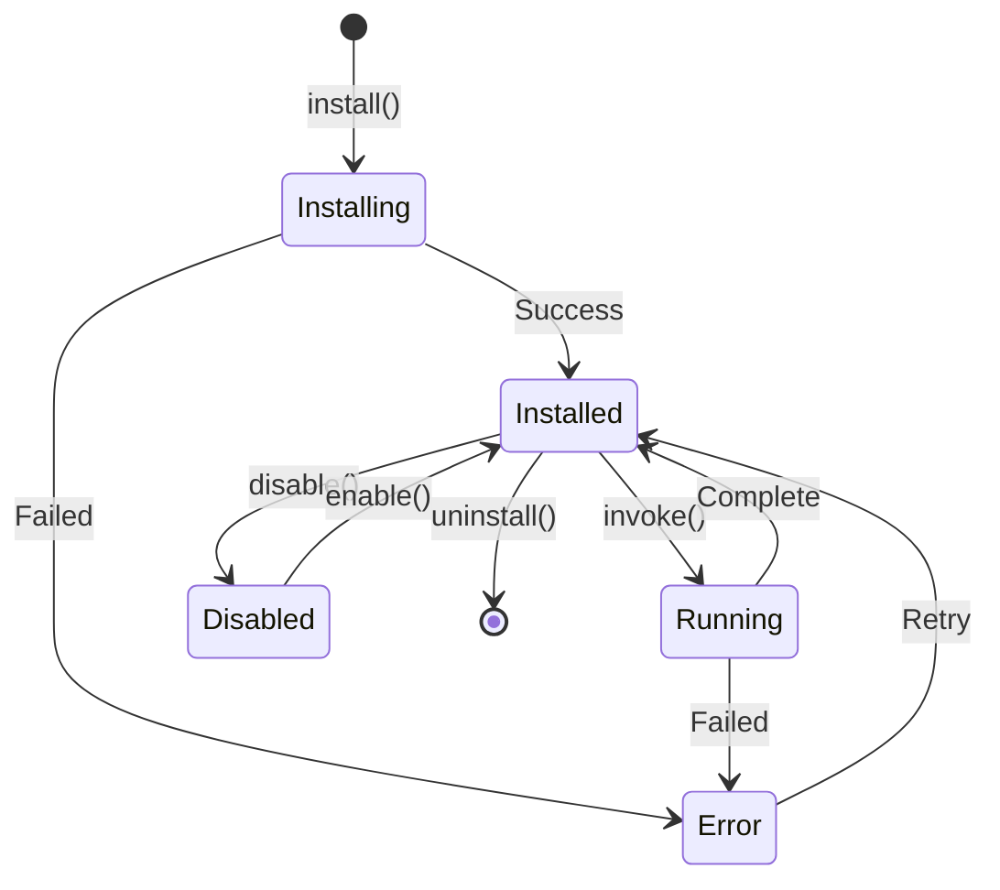
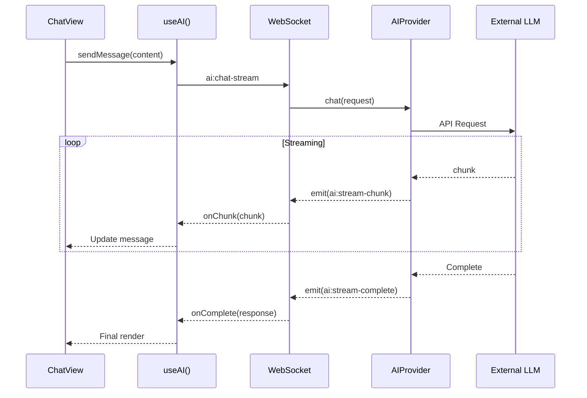
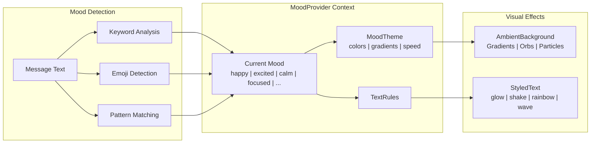
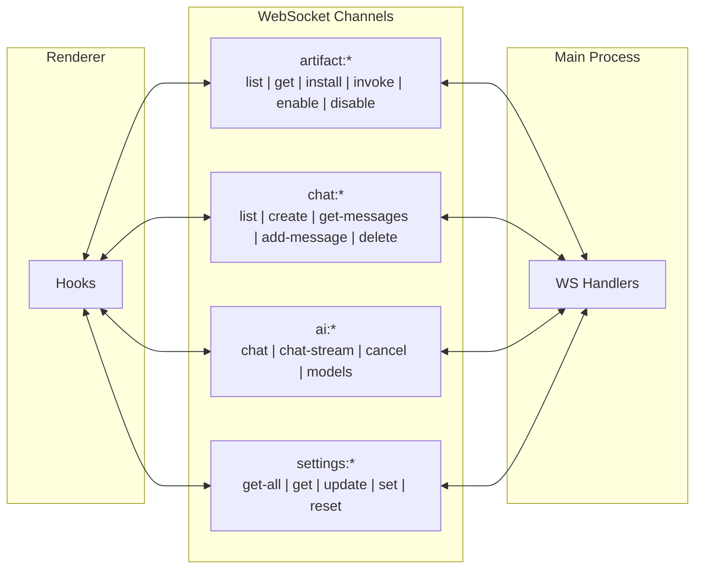

# CLAUDE.md

This file provides guidance to Claude Code (claude.ai/code) when working with code in this repository.

## Project Overview

YAAI (Yet Another AI Interface) - A desktop AI chat application built with Electrobun (Bun-based Electron alternative). Features a layered workspace layout system, comprehensive artifact/plugin architecture, and 70+ production-grade React components with heavy CSS animations.

## Commands

```bash
# From /app directory:
bun install              # Install dependencies
bun run start            # CSS build + electrobun dev (hot reload)
bun run build            # CSS build + electrobun build (production)
bun run css              # One-time Tailwind build
bun run css:watch        # Tailwind watch mode
```

Note: Kill CEF processes before rebuilding: `pkill -f electrobun`

## Architecture

### Process Model



### Data Storage



### Tech Stack
- **Runtime**: Electrobun (Bun + CEF)
- **UI**: React 19, Radix UI primitives, Tailwind CSS
- **Routing**: wouter
- **Markdown**: react-markdown + rehype-highlight + remark-gfm
- **Icons**: lucide-react, simple-icons

## Workspace Layout System



## Component Architecture



## Artifact System



### Artifact Lifecycle



### Handler Interface

```typescript
interface ArtifactHandler<TInput, TOutput> {
  execute(input: TInput, context: ExecutionContext): Promise<TOutput>;
  onInstall?(context): Promise<void>;
  onUninstall?(context): Promise<void>;
  validate?(input: TInput): ValidationResult;
}

interface ExecutionContext {
  apis: Record<string, AuthenticatedClient>;  // Pre-authenticated API clients
  artifacts: ArtifactInvoker;                 // Invoke other artifacts
  storage: ArtifactStorage;                   // Key-value storage
  logger: ArtifactLogger;
  signal: AbortSignal;
}
```

## AI Chat Flow



## Effects System (Disabled by Default)



## Hooks

- `useArtifacts()` - Artifact CRUD and invocation
- `useAI()` - AI provider, streaming, model selection
- `useSettings()` - Settings persistence
- `useChatHistory()` - Chat loading/saving
- `useEffectsSettings()` - Mood/effects settings

## WebSocket Channels



### Communication Protocol

All frontend-backend communication uses WebSocket (port 3001 by default, configurable via `WS_PORT` env var).

**Request/Response Pattern:**
```typescript
// Frontend sends request
sendMessage('chat:list') // Returns Promise<ChatMetadata[]>

// Backend handles request
wsServer.onRequest('chat:list', async () => chatStore.list())
```

**Event Pattern (Server → Client):**
```typescript
// Backend emits event
wsServer.emit('ai:stream-chunk', { requestId, chunk })

// Frontend subscribes
onMessage('ai:stream-chunk', (data) => handleChunk(data))
```

## UI Design Philosophy

Heavy CSS animations for polish - transitions, microinteractions, engaging visual feedback. Prioritize perceived performance and delightful interactions. Small components enable surgical animation control.

## Development Notes

- User runs Electron (the Electrobun app), Claude runs mock API for development/testing
- Effects/mood system disabled in demo to prevent render loops
- Actual AI integration and streaming are defined but not fully wired to UI
