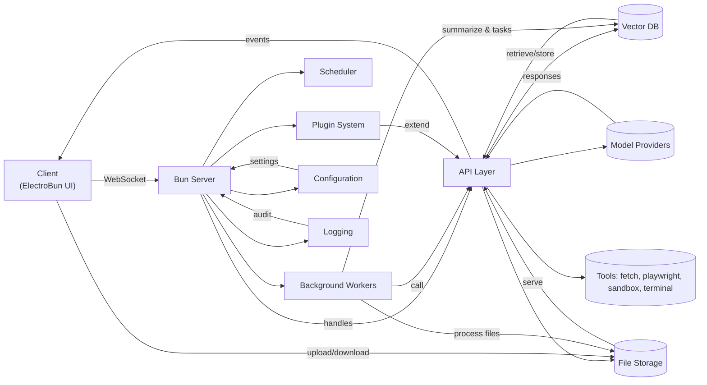

YAAI - yet anoither ai interface
=======================================
A modular, extensible AI interface for creative workflows.
big focus: great ui / ux, since this is a creative project we are going to make it look and feel great to use, visually appealing, interactive, engaging, etc. This involves using a lot of cool and fun animations, transitions, microinteractions, etc. We want the user to feel like they are using a high quality product that is enjoyable to use. CSS animations will be HEAVILY used throughout the app to achieve this while keeping performance high. 
Outline
-------
- features
- components
- architecture
-------
features
- the basics
    - electrobun (bun version of electron)
    - typescript, react
    - desktop application (windows, mac, linux)
    - radix, tailwind, shadcn ui  node sass
    - built in bun server for api requests, file handling, vector db, etc
- chat interface
    - memory system
        - background worker makes brief summaries of each message
        - these summaries are stored in a vector database
        - when a new message is sent, relevant memories are retrieved and presented to the model as context
        - user can save important messages to memory manually
        - summary of relevant context agent (see below) plays into memory system
        - can be defaulted to the specific prompt for all chat histories or globally applied with overrides per chat.
    - multi-model support (parallel requests, model switching)
        - user can +model_name to target many models in one message
        - all responses are shown in the same chat interface, either by stacking, side-by-side, or tabbed views.
        - the user 'Likes' the best response which is what gets used for building context when making further requests.
    - prompt management
        - save/load prompts
        - prompt variables
            - user can define variables that are used in prompts that can be text strings, or javascript functions that return strings (time, date, random values, etc) or rest API calls.
        - prompt templates
    - attachments support
        - user can attach files to messages
        - files are stored and can be retrieved by the model as context
        - vision models can interpret images, videos, and other visual media within the chat interface for non-vision models (see vision proxies below)
        - handle display of files in chat properly (thumbnails, previews, download links)
        - formatting of file content for model context (text extraction, summarization, etc)
        - user can directly reference attachments from their filesystem with /file/path/to/file.ext
    - token estimation and management
    - tools integration (no mcp)
        - rest api integration with any api endpoint to pull data into the chat for the model to use.
        - read/write files from chat
        - web browsing (fetch, playwright)
            - fetch: simple rest api calls to get data from the web
            - playwright: will run the browser in the background, serve a slideshow of the browser to the user, and allow the model to interact with the browser (click, type, navigate, etc), ask for user input when needed directly in the chat interface and last resort is to spawn the playwright browser window for the user to interact with directly.
        - code execution (sandboxed)
        - terminal access (show the ai terminal, user can run commands)
    - summary of relevent context agent
        - a background agent that can be shown on the side of the chat, that reviews all messages and attachments, and continually updates a summary of relevant context which can be used by other chats to contexualize and personalize responses.
        - plays into memory system
    - vision proxies
        - allow vision models to access and interpret images, videos, and other visual media within the chat interfacce for non-vision models.
    - live prompt enhancement for image generation
        - a toggle that allows the user to briefly type a prompt to any model, the model then will write the prompt in a more detailed and enhanced way for image generation models and then return the images in the chat. this will allow users to use any model to then generate with any image generation model.
    - export chat histories
        - export to markdown, html, json
    - integrated display of html, markdown, react components in chat messages, csv, etc.

- architecture
 here is the flow
 the client is connected to the bun server via websocket.
 the api makes all the requests out to various model providers, vector db, file storage, etc.
 the bun server then serves the client with data via websocket events.
 the client sends user actions to the bun server via websocket events.
 the bun server handles all the logic for processing user actions, making api requests, storing data, etc.
 the bun server also has background workers for handling long running tasks, such as memory summarization, tool execution, etc.
 the bun server also has a scheduler for handling periodic tasks, such as cleaning up old data, summarizing memories, etc.
 the bun server also has a plugin system for adding new features and integrations.
 the bun server also has a configuration system for managing settings and preferences.
 the bun server also has a logging system for tracking errors and events.
