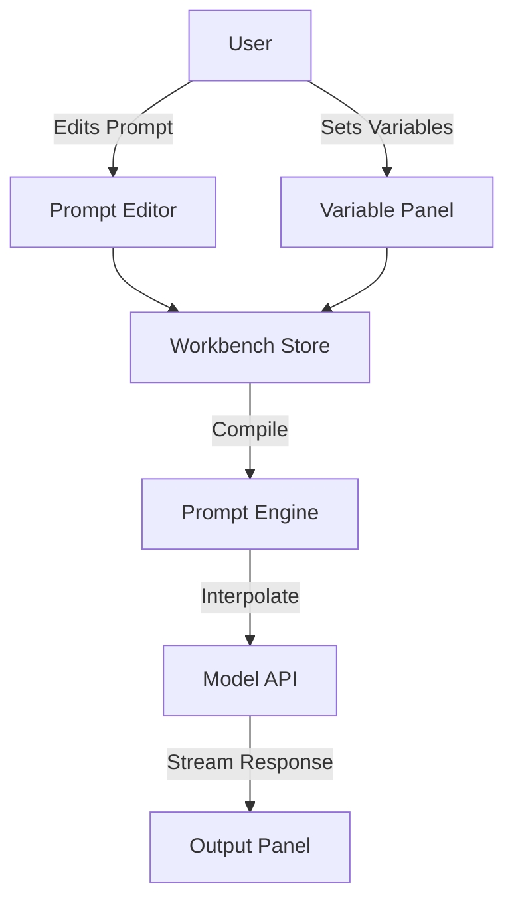

# Workbench — Single Source of Truth Specification

> Version: 0.1.0 (MVP)
> Last Updated: 2026-01-02

---

## Table of Contents

1. [Overview](#1-overview)
2. [Goals & Concepts](#2-goals--concepts)
3. [Architecture](#3-architecture)
4. [Data Models](#4-data-models)
5. [UI Components](#5-ui-components)
6. [State Management](#6-state-management)

---

## 1. Overview

The **Workbench** is a dedicated environment for "Prompt / Context Forging." It allows users to craft complex prompt chains, define system instructions, and simulate interactions with AI models in a controlled, iterative manner. It is modeled after the Claude Console Workbench, prioritizing a clean, split-screen interface for editing inputs and viewing outputs.

---

## 2. Goals & Concepts

### 2.1 Core Goals (MVP)
1.  **Context Construction**: enabling users to build a "context" from multiple message blocks (System, User, Assistant).
2.  **Variable Injection**: Support for `{{VARIABLE}}` syntax in prompts, with a UI to define test values for these variables.
3.  **Iterative Testing**: Quick "Run" capability to test the current context against a selected model.
4.  **Code Generation**: Ability to export the current prompt configuration as code (curl, python, node, etc.).

### 2.2 Key Concepts
-   **Forging**: The process of assembling a prompt from various distinct parts (System Instructions + Few-Shot Examples + Current User Input).
-   **Variables**: Dynamic placeholders that allow a single prompt structure availability to be tested across multiple scenarios without rewriting the prompt.
-   **Prompt Library**: A collection of saved prompt configurations, accessible via the main navigation.
    -   **System Templates**: Reusable system instructions (e.g., "Creative Writer", "JSON Coder").
    -   **Full Contexts**: Complete chat scenarios including message history and specific variable presets.

---

## 3. Architecture

The Workbench operates as the primary view for the `Prompts` route in the application.

### 3.1 Routing & Navigation
-   **Entry Point**: Main Navigation > `Prompts` button.
-   **Landing View**: "Prompt Library" (Grid/List of saved templates and contexts).
-   **Detail View**: The "Workbench" (Forging interface) for the selected item.

### 3.1 System Diagram


---

## 4. Data Models

### 4.1 Workbench Session
State representing a single open "file" or session in the workbench.

```typescript
interface WorkbenchSession {
  id: string
  name: string
  lastModified: number
  
  config: ModelConfig
  context: MessageBlock[]
  variables: VariableDefinition[]
}

interface ModelConfig {
  modelId: string
  temperature: number
  maxTokens: number
  topP?: number
}
```

### 4.2 Message Block
The fundamental building block of a prompt context.

```typescript
type Role = 'system' | 'user' | 'assistant'

interface MessageBlock {
  id: string              // uuid
  role: Role
  content: string         // features {{variable}} syntax
  isPrefill?: boolean     // for assistant pre-fill
}
```

### 4.3 Variable Definition

```typescript
interface VariableDefinition {
  name: string            // key (without braces) e.g., "CONTEXT"
  currentValue: string    // The value to use for the next run
}
```

---

## 5. UI Components

The UI is divided into two primary columns.

### 5.1 Landing: Prompt Library
Before entering the Forge, users select a starting point from the library.
-   **Tabs/Filters**:
    -   *Templates*: System prompts only.
    -   *Scenarios*: Full multi-turn context setups.
-   **Actions**: `Create New`, `Duplicate`, `Delete`.

### 5.2 Left Column: The Forge (Input)
-   **Model Selector Header**: Dropdown to select the model and adjust parameters (Temperature, Max Tokens).
-   **System Prompt Area**: A distinct block at the top for system instructions.
-   **Message Stream**: A vertical list of message blocks (User/Assistant).
    -   *Add User/Assistant Message* buttons.
    -   *Drag-and-drop* reordering (MVP: maybe just append).
-   **Variable Panel**: A collapsible or persistent section detecting `{{}}` syntax in blocks and offering input fields for each unique variable found.

### 5.2 Right Column: The Preview (Output)
-   **Response Area**: Where the AI's response is streamed.
-   **Run Button**: Triggers the generation.
    -   *Keyboard Shortcut*: `Cmd+Enter` / `Ctrl+Enter`.
-   **Get Code**: Opens a modal showing the raw API payload or generated code snippet.

### 5.3 UX Interactions
-   **Variable Highlight**: When a user types `{{`, the UI should visually indicate a variable is being created.
-   **Auto-Resize**: Textareas should auto-grow to fit content.

---

## 6. State Management

The workbench state should be isolated from the main chat or image gen state.

```typescript
interface WorkbenchState {
  // Active Session
  currentSession: WorkbenchSession
  
  // UI State
  isGenerating: boolean
  streamContent: string // The content currently streaming in
  
  // Actions
  setSystemPrompt: (text: string) => void
  addMessage: (role: Role) => void
  updateMessage: (id: string, content: string) => void
  removeMessage: (id: string) => void
  setVariableValue: (name: string, value: string) => void
  runGeneration: () => Promise<void>
}
```
